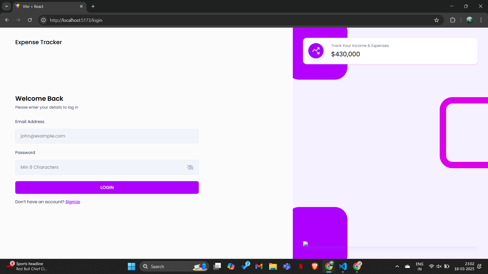
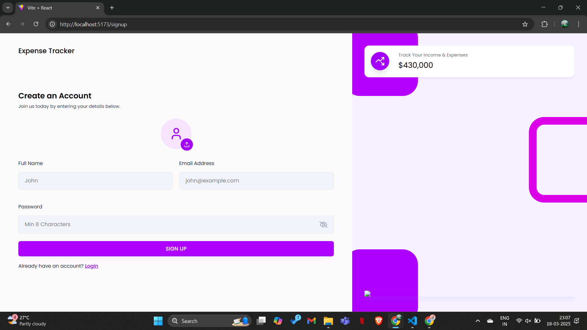
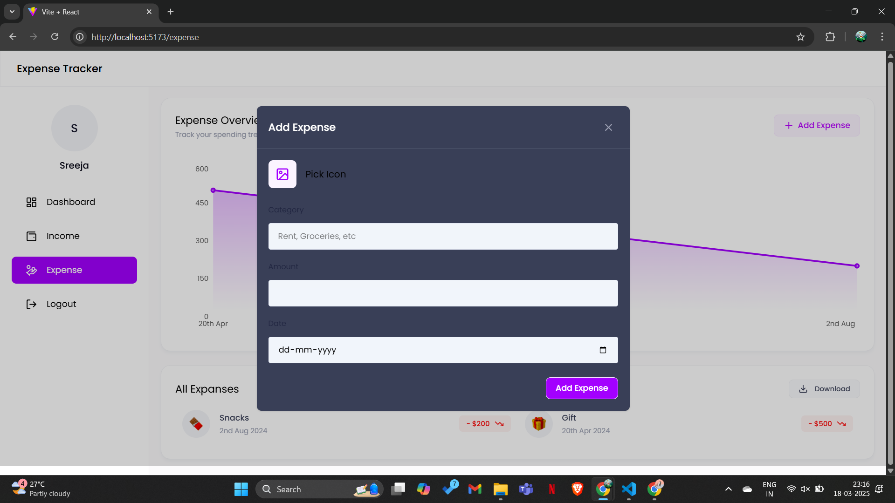
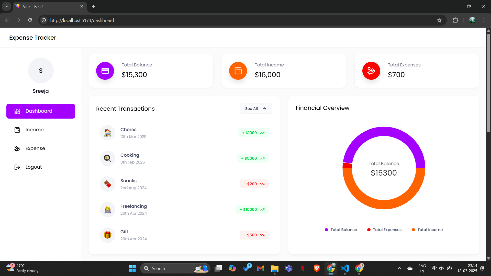
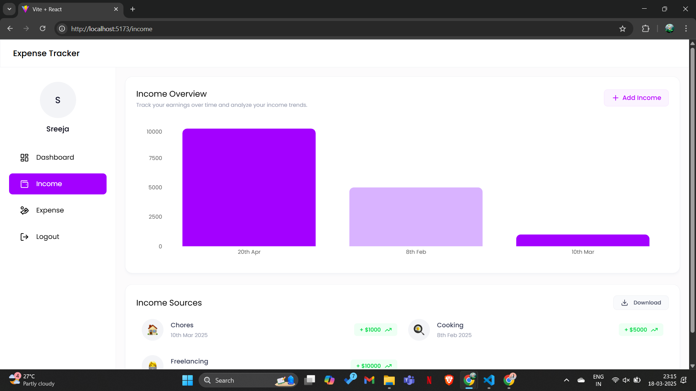
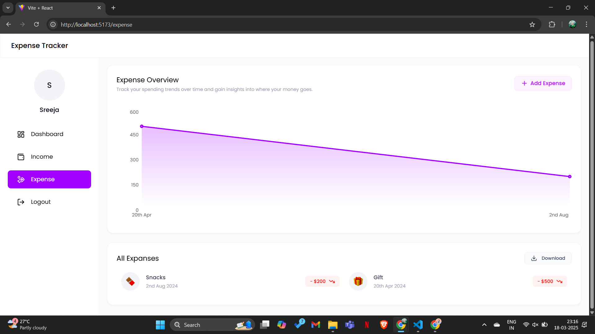

# Expense Tracker

## 📌 Project Overview
Expense Tracker is a fun and interactive web application that helps you manage your expenses and income effortlessly! With a user-friendly interface, tracking your finances has never been easier. 💰📊

## 🚀 Features
- 🔐 *User Authentication* (Sign up & Log in)
- 💸 *Track Expenses* - Add, view, and delete your spending
- 💰 *Manage Income* - Keep an eye on your earnings
- 📂 *Download Reports* - Export expenses and income as Excel files
- 📊 *Dashboard* - Get a quick financial summary

## 🛠 Technologies Used
- 🎨 *Frontend*: React
- 🔙 *Backend*: Node.js, Express
- 🗄 *Database*: MongoDB
- 📦 *Other Libraries*: Mongoose, Bcryptjs, Jsonwebtoken, Multer, Cors, Dotenv

## 📥 Installation

### 🔧 Backend Setup
1. Navigate to the backend directory:
   bash
   cd backend
   
2. Install dependencies:
   bash
   npm install
   
3. Create a .env file in the backend directory and add the necessary environment variables (e.g., database connection string, port).
4. Start the server:
   bash
   npm run dev
   

### 🎨 Frontend Setup
1. Navigate to the frontend directory:
   bash
   cd frontend/expense-tracker
   
2. Install dependencies:
   bash
   npm install
   
3. Start the frontend application:
   bash
   npm run dev
   

## 🔗 API Endpoints

### 🔑 Authentication
- 🔹 POST /api/v1/auth/register - Register a new user
- 🔹 POST /api/v1/auth/login - Log in a user
- 🔹 GET /api/v1/auth/getUser - Get user information (protected)

### 💰 Income Management
- ➕ POST /api/v1/income/add - Add new income (protected)
- 📄 GET /api/v1/income/get - Get all income entries (protected)
- 📥 GET /api/v1/income/downloadexcel - Download income as Excel (protected)
- ❌ DELETE /api/v1/income/:id - Delete income by ID (protected)

### 💸 Expense Management
- ➕ POST /api/v1/expense/add - Add new expense (protected)
- 📄 GET /api/v1/expense/get - Get all expenses (protected)
- 📥 GET /api/v1/expense/downloadexcel - Download expenses as Excel (protected)
- ❌ DELETE /api/v1/expense/:id - Delete expense by ID (protected)

### 📊 Dashboard
- 📈 GET /api/v1/dashboard - Get dashboard data (protected)

## 📜 License
This project is licensed under the *ISC License*. 📄

## 👩‍💻 Author
💡 Created by *Sreeja Sadhu* 🚀

*HOW THE PROJECT WORKS*

